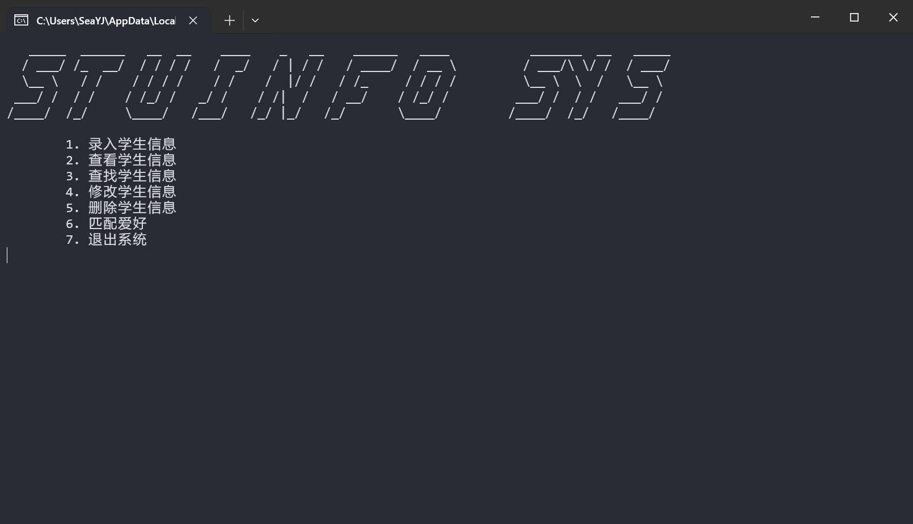
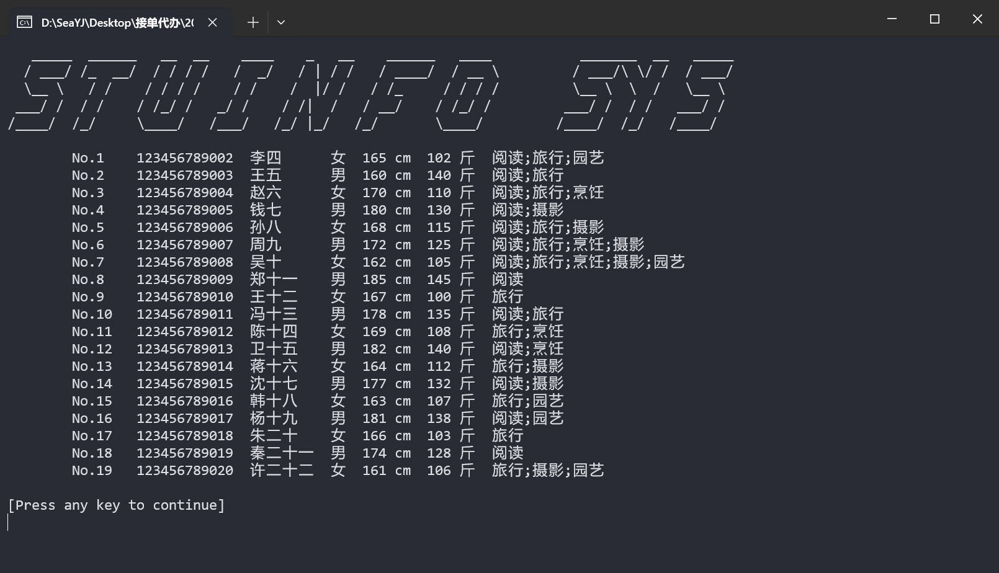

# 🎓 学生信息管理系统

这是一个基于 C 语言开发的学生信息管理系统。 它有一个精心设计和用户友好的界面，易于使用和优雅✨。该系统提供有效的数据管理功能，允许用户轻松添加，更改和删除学生信息📚。这是一个非常好的学习项目📖。

## 📖 项目说明

该项目是一个学生信息管理系统，旨在帮助学生和初学者学习 C 语言的基本编程技能，同时了解如何设计和实现一个简单的管理系统。由于这个项目，用户可以学习如何用 C 语言执行文件操作，内存管理和用户操作。项目功能包括:

- **添加学生信息**：用户可以添加新的学生信息，包括姓名、学号、性别、身高、体重、爱好。
- **查找学生信息**：用户可以通过姓名、学号、性别来筛选特定的学生信息。
- **显示所有学生信息**：用户可以查看所有已添加的学生信息列表。
- **修改学生信息**：用户可以根据学号查找并修改学生的详细信息。
- **删除学生信息**：用户可以根据学号删除不需要的学生信息。
- **匹配爱好**：用户可以通过爱好进行匹配具有相同兴趣爱好的学生。

## 🖼️ 运行截图

## 📜 开源证书

本项目使用 MIT 许可证。MIT 许可证是一种开源许可证，允许用户自由使用、复制、修改、合并、出版、分发、再授权和出售软件的副本。唯一的要求是，在软件的所有副本或重要部分中都必须包含原始许可证的声明和版权声明。

MIT 许可证的[全文链接](./LICENSE)

希望这个学生信息管理系统能为您的学习和项目开发提供帮助。如果有任何问题或建议，欢迎与我联系📬。